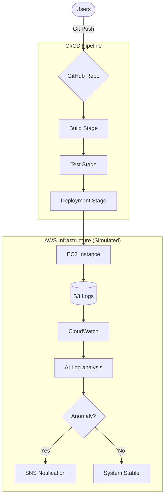
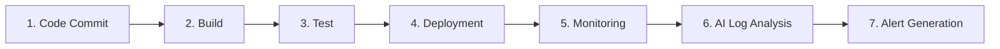
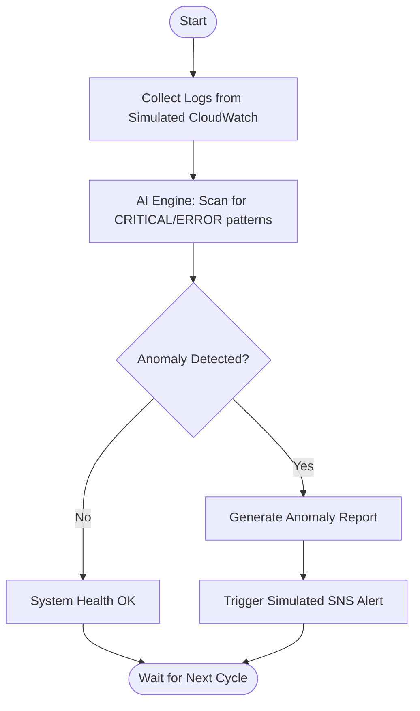

# AI-Driven CI/CD Monitoring Pipeline with AWS Architecture Simulation 🚀

Developed by **Sachin C S** | DevOps & Cloud Simulation Specialist

---

## 📌 Project Overview

Welcome to the **AI-Driven CI/CD Monitoring Pipeline**! This project is a production-simulated DevOps ecosystem that bridges the gap between automated software delivery and intelligent system monitoring.

It demonstrates a 7-stage pipeline—from the first line of code to real-time AI log analysis—modeled after enterprise AWS architecture.

---

## 🏗️ Architecture Visualization

### 🛠️ High-Level Infrastructure



### 📈 Pipeline Flow



### 🔄 Logic Flow



---

## ☁️ AWS Architecture (Simulated)

This project leverages shell scripting to model a complete AWS environment:

- **Simulated EC2**: Deployment target for the web application artifacts.
- **Simulated S3**: Repository for build assets and persistent system logs.
- **Simulated CloudWatch**: Engine for health metric generation and log aggregation.
- **Simulated IAM**: Demonstrates role-based execution policies for secure phase transition.

---

## 🤖 AI Monitoring & Anomaly Detection

The core innovation is the `ai_log_analyzer.sh` script, which simulates an AI engine scanning for operational hazards:

- **Pattern Recognition**: Detects abnormal error spikes and critical resource exhaustion.
- **Real-time Analytics**: Correlates different log events to identify root causes.
- **Automated Response**: Triggers simulated SNS notifications for rapid DevOps intervention.

---

## 🚀 How to Execute the Simulation

### Pre-requisites

- **Environment**: A Bash-compatible terminal (Git Bash, WSL, or Linux).
- **Permissions**: Ensure scripts have execution rights.

### Commands

```bash
# 1. Clone the repository
git clone https://github.com/01Sachinc/aws-ai-cicd-monitoring.git
cd aws-ai-cicd-monitoring

# 2. Grant execution permissions
chmod +x scripts/*.sh

# 3. Launch the complete pipeline
bash scripts/pipeline.sh
```

---

## 📁 Repository Structure

```text
aws-ai-cicd-monitoring/
├── README.md               # Premium Documentation by Sachin C S
├── architecture/           # High-resolution diagrams
├── .github/workflows/      # GitHub Actions automation
├── scripts/                # Modular simulation engine
└── logs/                   # Simulated production logs
```

---

## 💡 Learning Outcomes

Through this project, the following DevOps concepts are demonstrated:

- **CI/CD Pipeline Automation**
- **Infrastructure Monitoring**
- **Log Analysis Automation**
- **Cloud Architecture Design**
- **DevOps Workflow Implementation**
- **Bash Script Automation**

---

## 📌 Future Improvements

- Integrate real AWS services
- Add Terraform Infrastructure as Code
- Implement real AI log anomaly detection
- Add Docker container deployment
- Integrate Kubernetes pipeline

---

## 👨💻 Author

### **Sachin C S**

**AWS Cloud & DevOps Engineer**  
Linux Administrator | Infrastructure Automation

📧 **Email**: [cssachin83@gmail.com](mailto:cssachin83@gmail.com)  
📱 **Phone**: +91 8496001030

---

## 🌐 Connect With Me

[LinkedIn](https://www.linkedin.com/in/sachincs) | [GitHub](https://github.com/01Sachinc)
