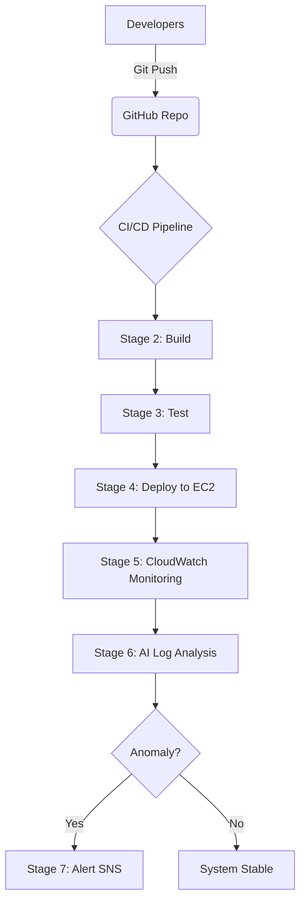

# AI-Driven CI/CD Monitoring Pipeline with AWS Architecture Simulation 🚀

Developed by **Sachin** | DevOps & Cloud Simulation Specialist

---

## 📌 Project Overview

Welcome to the **AI-Driven CI/CD Monitoring Pipeline**! This project is a production-simulated DevOps ecosystem that bridges the gap between automated software delivery and intelligent system monitoring.

It demonstrates a 7-stage pipeline—from the first line of code to real-time AI log analysis—modeled after enterprise AWS architecture.

---

## 🏗️ Architecture Visualization

### 🛠️ High-Level Infrastructure


### 📈 Pipeline Flow


### 🔄 Logic Flow (Mermaid)



---

## ☁️ AWS Architecture (Simulated)

This project leverages shell scripting to model a complete AWS environment:

- **Simulated EC2**: Deployment target for the web application artifacts.
- **Simulated S3**: Repository for build assets and persistent system logs.
- **Simulated CloudWatch**: Engine for health metric generation and log aggregation.
- **Simulated IAM**: Demonstrates role-based execution policies for secure phase transition.

---

## 🤖 AI Monitoring & Anomaly Detection

The core innovation is the `ai_log_analyzer.sh` script, which simulates an AI engine scanning for operational hazards:

- **Pattern Recognition**: Detects abnormal error spikes and critical resource exhaustion.
- **Real-time Analytics**: Correlates different log events to identify root causes.
- **Automated Response**: Triggers simulated SNS notifications for rapid DevOps intervention.

---

## 🚀 How to Execute the Simulation

### Pre-requisites

- **Environment**: A Bash-compatible terminal (Git Bash, WSL, or Linux).
- **Permissions**: Ensure scripts have execution rights.

### Commands

```bash
# 1. Clone the repository
git clone https://github.com/01Sachinc/aws-ai-cicd-monitoring.git
cd aws-ai-cicd-monitoring

# 2. Grant execution permissions
chmod +x scripts/*.sh

# 3. Launch the complete pipeline
bash scripts/pipeline.sh
```

---

## 📁 Repository Structure

```text
aws-ai-cicd-monitoring/
├── README.md               # Premium Documentation by Sachin
├── architecture/           # High-resolution diagrams
├── .github/workflows/      # GitHub Actions automation
├── scripts/                # Modular simulation engine
└── logs/                   # Simulated production logs
```

---

## 💼 LinkedIn & Resume Showcase

**Author**: Sachin  
**Specialization**: DevOps Automation & Cloud Architecture

### LinkedIn Post Content

**Headline**: Just launched a simulated AI-Driven CI/CD Pipeline! 🚀

I've been working on a project that simulates a complete DevOps lifecycle with an AI-inspired twist. This project demonstrates:
✅ 7-Stage automated CI/CD pipeline using Shell Scripting.
✅ AI-Driven Anomaly Detection for infrastructure health.
✅ Simulated AWS architecture with EC2, S3, and CloudWatch integration.
✅ Automated verification via GitHub Actions.

Built this to showcase how deep automation and proactive monitoring can safeguard modern cloud environments.

Check it out: [Repo Link]

#DevOps #AWS #Automation #CloudSecurity #SachinPortfolio #CICD

### Resume Bullet Points

- **Engineered an AI-Driven CI/CD Pipeline Simulation**: Developed a 7-stage automated workflow in Bash, achieving seamless build, test, and deployment phases.
- **Implemented Anomaly Detection Logic**: Created a pattern-matching monitoring engine capable of identifying resource spikes and error clusters in production logs.
- **Architected Simulated AWS Infrastructure**: Modeled enterprise-grade cloud environments (EC2, S3, CloudWatch) to demonstrate proficiency in infrastructure-as-code and monitoring strategies.
- **Automated Pipeline Verification**: Integrated GitHub Actions to ensure 100% reliability in simulation execution across different environments.
